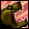

# essential-wow
Min maxing WoW UI &amp; more

https://github.com/tukui-org/ElvUI/wiki/performance-optimization

main.lua

	function CheckUpdateName(frame)
		local o = frame.state.name
		local n = o

		words = {}
		for word in o:gmatch("%w+") do name = word end

		frame.state.name = name
		frame.NameText:SetText(name)

		-- local name = frame.state.name

		-- for k, v in pairs(opt.env.Renames) do
			-- if (k == name) then
				-- frame.state.name = v
				-- frame.NameText:SetText(v)
			-- end
		-- end
	end
	
create.lua

    local function Arrows_UpdatePosition(self)
	self.l:SetPoint('RIGHT',self.parent.bg,'LEFT',25,0)
	self.r:SetPoint('LEFT',self.parent.bg,'RIGHT',-25,0)
    end
    
castbar.lua

    if f.elements.SpellName then
		words = {}
		for word in f.cast_state.name:gmatch("%w+") do name = word end
        f.SpellName:SetText(name)
    end

todo: automatic img downloader https://www.wowdb.com/spells/class-abilities/shaman
todo: automatic spell priority generator

/console UnitNameGuildTitle 0

/console UnitNamePlayerGuild 0

/console UnitNamePlayerPVPTitle 0

/console cameraDistanceMaxZoomFactor 2.6

/run SetCVar("showQuestTrackingTooltips", 0)
^  not sure if this one works
